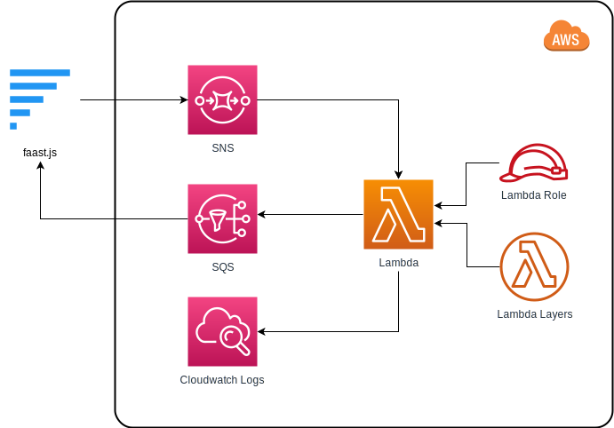

# Running faast.js on AWS Lambda

## Setup

To use faast.js with AWS, you need to create an account and credentials for an IAM user. To setup credentials for [AWS](https://docs.aws.amazon.com/cli/latest/userguide/cli-chap-getting-started.html):

- If you haven't already, set up the [AWS CLI](https://docs.aws.amazon.com/cli/latest/userguide/installing.html):
  ```
  pip install awscli --upgrade --user
  ```
- Create an IAM user in the AWS console.
- Setup an access key ID and secret access key for the IAM user.
- Add these credentials to your local machine with aws cli (`aws configure`).
- Ensure AWS user has AdministratorAccess role and Administrator group.

That's it. Now you should be able to run faast.js with AWS Lambda.

## Using [`faastAws`](./api/faastjs.faastaws.md)

Using the [`faast`](./api/faastjs.faast.md) function works well with AWS, but the [`faastAws`](./api/faastjs.faastaws.md) function allows you to specify more specific [`AwsOptions`](./api/faastjs.awsoptions.md).

The most likely reason to use `faastAws` is to specify the region:

```typescript
faastAws(m, "/path", { region: "us-east-1" });
```

## AWS Resources

The following diagram shows the AWS resources that faast.js creates:



In the `cleanup` function the SNS topic, SQS queue, and Lambda function are deleted. Lambda Layers are retained for 24 hours, then removed by the next faast.js instance that runs garbage collection. The Lambda Role remains permanently.

All faast.js AWS resources can be removed using the [faastjs cleanup command](./01-introduction#cleanup-command).

## Logs

AWS requires a new Cloudwatch log group to be created for each lambda function. So you're likely to see many log groups created when using faast.js. These log groups have their log streams expire automatically after 24h, and empty log groups are removed by garbage collection the next time faast.js garbage collection runs.

To view logs, see [`logUrl`](./api/faastjs.faastmodule.logurl.md).

Log ingestion is not included in faast.js cost estimates.

## Dependencies and Packaging

By default, AWS does not provide a package dependency solution. Faast.js adds dependency bundling automatically using two different methods: webpack bundling and remote npm install.

Webpack bundling happens by default. When you specify a module to the `faast` or `faastAws` function, the module and its dependencies are collected by webopack and bundled into a single `.js` file. This placed into a zipfile and sent to AWS Lambda as the code package. If you install dependencies using `package.json` and `import` or `require` them in the usual way, then webpack should be able to bundle your dependencies with no extra effort on your part.

There are a few drawbacks with the default webpack approach. The first drawback is that the code bundle needs to be uploaded every time you invoke `faast` because it creates fresh infrastructure each time it initializes. If the bundle is large, this can take a substantial amount of time. Worse, AWS limits code package sizes using direct upload to 50MB. The second drawback is that native dependencies are not supported in this way because webpack cannot bundle them.

To solve these issues, faast.js has the [`packageJson`](./api/faastjs.commonoptions.packageJson.md) option. Dependencies that are not specified in `packageJson` will still be bundled as usual by webpack. For dependencies that _are_ specified in `packageJson`, faast.js will install the dependencies using a separately created Lambda function and save them in a cached Lambda Layer. In this way, native dependencies can be used. Using this method also increases the total code size maximum to 250MB (unzipped).

A good way to setup dependencies is therefore the following:

- If you don't need native dependencies and your code size does not exceed 50MB, you don't need to specify dependencies explicitly and you don't need to use the `packageJson` option.

- If you do need `packageJson`, then ensure that the dependencies specified in it are a subset of the dependencies in your project's `package.json` file. The dependencies should also have the same version constraints. The reason this is necessary is because the code you write locally is typed against the locally installed package, but the remote code will use the version specified in `packageJson`. The goal of this rule is to ensure that these versions are identical.

- It is possible to specify your project's `package.json` file as the `packageJson` option. The main drawback of this is that there may be a large number of dependencies in the project not needed for the remote faast functions, and the dependencies may be too large in aggregate.

To inspect what the bundled code package looks like, see [`FAAST_PACKAGE_DIR`](./02-development-workflow#understanding-code-bundles-with-faast_package_dir).

## Queue vs Https mode

There are two [modes of invocation](./api/faastjs.commonoptions.mode.md) for AWS with faast.js, https and queue. In AWS, queue mode uses SNS to invoke lambda, whereas https mode uses a direct Lambda API invocation. Here's how these compare on AWS:

|                           | https mode | queue mode |
| ------------------------- | ---------- | ---------- |
| latency                   | low        | higher     |
| maximum argument size     | 6MB        | 256kb      |
| maximum return value size | 6MB        | 256kb      |
| max invocations / sec     | ~300/sec   | > 600/sec  |

In practice, the lower invocations/sec possible with https mode is acceptable because real-world invocations often take longer than a few seconds. However, for microbenchmarks and certain applications where ops/s is most important, queue mode may be preferable.

The default is https mode.

## IAM Roles

Faast.js will create an IAM role `faast-cached-lambda-role` for the lambda function it creates. By default this role will have administrator access. The role will be created dynamically and will remain in your account cached even after cleanup function is called.

If you remove this role, it will be created again the next time faast.js runs.
